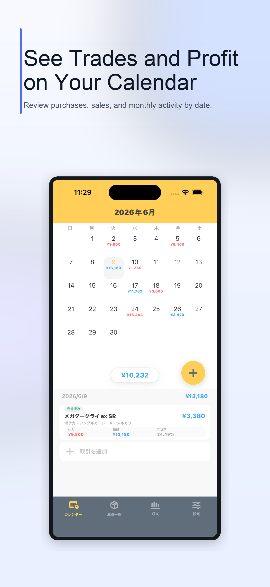
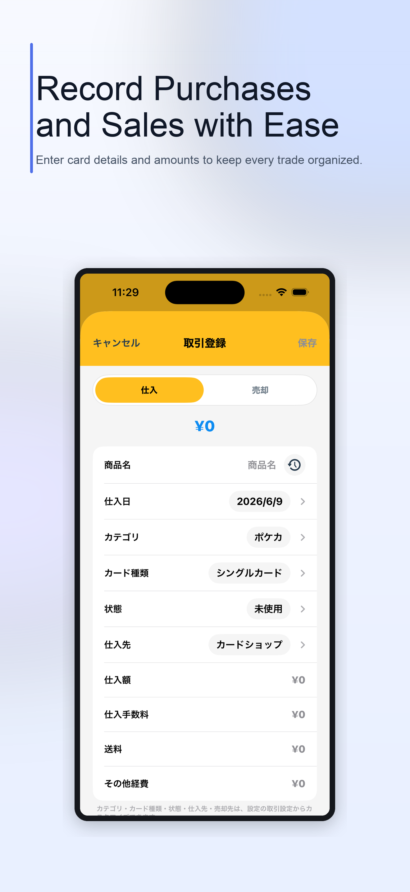
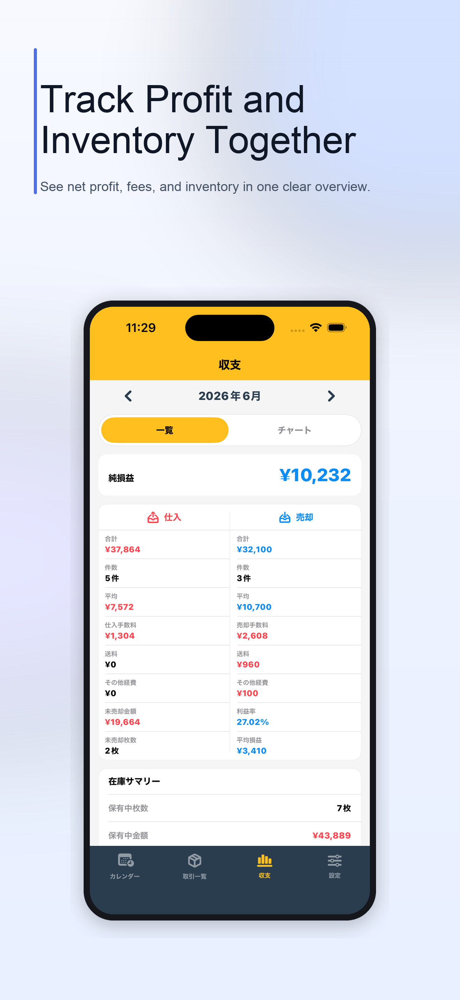

# Store Screenshot Generator

[日本語](README.md)


[](https://github.com/BySho2/store-screenshot-generator/actions/workflows/tests.yml)
[](LICENSE)

Generate App Store and Google Play listing images from screenshots of your app.

The generator combines each app screenshot with localized headlines, supporting copy, and a customizable background. Content and visual settings live in YAML files, so you can reuse the same generator without editing the Python source for every app.

## Generated Example

See [examples/torekanri](examples/torekanri) for store listing images generated from screenshots of the real Torekanri app.

<p>
  
  
  
</p>

- [App Store, Japanese](examples/torekanri/generated/app-store/ja/torekanri_ja_01.png)
- [Google Play, Japanese](examples/torekanri/generated/google-play/ja/torekanri_ja_01.png)
- Configuration: [examples/torekanri/config.yaml](examples/torekanri/config.yaml)

## Supported Output

- Japanese and English
- App Store: iPhone 6.9-inch portrait (`1320 x 2868`)
- Google Play: phone portrait (`1080 x 1920`)
- Apple and Google Play outputs generated in one run
- YAML configuration for copy, source screenshots, and visual themes
- Automatic Japanese and English line wrapping and text sizing
- PNG, JPEG, and WebP source images
- RGB PNG output without alpha channels
- Protection against accidental overwrites

## Generate the Sample

```bash
python3 -m venv .venv
source .venv/bin/activate
pip install -r requirements.txt

python examples/create_demo_screenshots.py
cp config.example.yaml config.yaml
python generate.py --config config.yaml
```

Japanese and English images are generated for both stores:

```text
output/
├── app-store/
│   ├── ja/
│   └── en/
└── google-play/
    ├── ja/
    └── en/
```

Use `--overwrite` only when you intend to replace existing generated images.

```bash
python generate.py --config config.yaml --overwrite
```

## Use It with Your App

1. Capture the app screens you want to use in your store listing.
2. Copy `config.example.yaml` to `config.yaml`.
3. Set each screenshot path and its Japanese and English copy in `config.yaml`.
4. Choose a theme and adjust it to match your app's brand when needed.
5. Run the generator.
6. Review every generated image for clipping, accuracy, and display order.

Your real app screenshots and `config.yaml` may contain private or unreleased information. Keep them in your own environment instead of committing them to this public repository.

The app name can also be localized:

```yaml
app:
  name:
    ja: サンプルアプリ
    en: Sample App
```

## Customize the Design

Three themes are included:

- `themes/premium-navy.yaml`
- `themes/minimal-light.yaml`
- `themes/sunny-yellow.yaml`

You can change background colors, typography, accent colors, screenshot size, shadows, and other visual settings in YAML. See [Custom Themes](docs/custom-themes.md).

## How Images Are Generated

See [How It Works](docs/how-it-works.md) for the complete pipeline from an app screenshot to store listing images.

## Tests

```bash
python -m unittest discover -s tests -v
```

Before rendering, the generator validates source images, localized copy, fonts, colors, output presets, and existing files.

## Store Image Requirements

Store requirements can change. Check the latest official specifications before uploading generated images.

- [Apple screenshot specifications](https://developer.apple.com/help/app-store-connect/reference/app-information/screenshot-specifications/)
- [Google Play preview asset requirements](https://support.google.com/googleplay/android-developer/answer/9866151)

## License

This project is available under the [MIT License](LICENSE). You may use, modify, and redistribute it for commercial or non-commercial purposes under the license terms.
