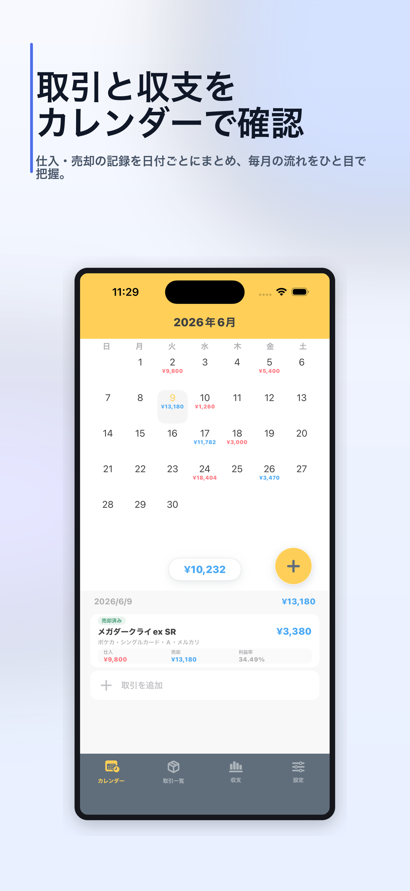
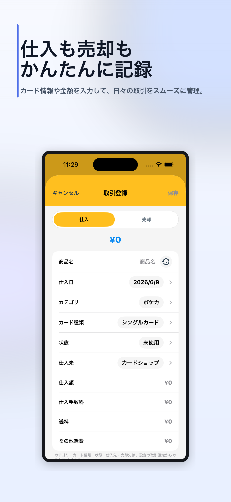
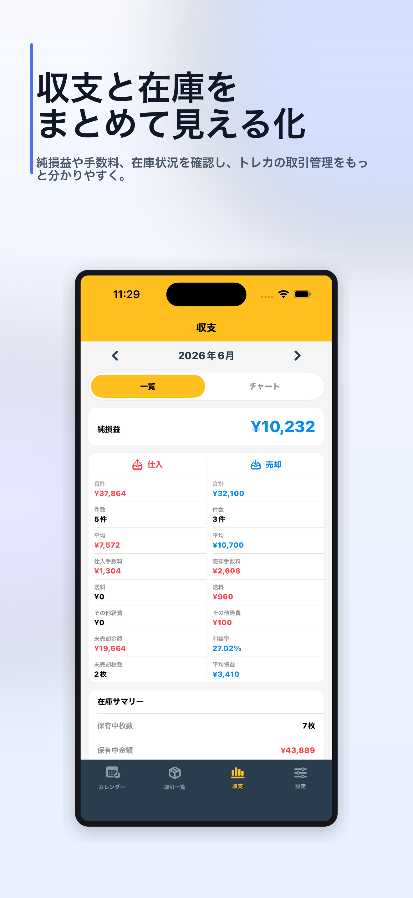

# Store Screenshot Generator

[English](README.en.md)


[](https://github.com/BySho2/store-screenshot-generator/actions/workflows/tests.yml)
[](LICENSE)

アプリ画面のスクリーンショットから、App Store／Google Playのストア掲載用画像を生成するPythonツールです。

アプリ画面に見出しや説明文、背景デザインを組み合わせ、日本語版と英語版をまとめて生成できます。デザインや文章はYAMLファイルで変更できるため、アプリごとにPythonコードを書き換える必要はありません。

## AIエージェントで使う

このリポジトリには、CodexとClaude Codeの両方で利用できる自己完結型のAgent Skillが含まれています。アプリの調査、撮影画面の選定、iOS Simulator／Android Emulatorからの撮影、日本語・英語コピーの作成、画像生成、最終確認までを一つのワークフローとして進めます。

### インストール

[Skillフォルダ](skills/store-listing-screenshots)全体を、利用するAIエージェントの個人Skillフォルダへインストールします。

```text
Codex：      ~/.agents/skills/store-listing-screenshots/
Claude Code：~/.claude/skills/store-listing-screenshots/
```

`SKILL.md`だけでなく、`scripts`、`assets`、`references`、`requirements.txt`を含むフォルダ全体が必要です。詳しくは[インストールガイド](skills/store-listing-screenshots/references/installation.ja.md)をご覧ください。

Codexでは、`$skill-installer`に次のSkillフォルダをインストールするよう依頼することもできます。

```text
https://github.com/BySho2/store-screenshot-generator/tree/main/skills/store-listing-screenshots
```

### 実行

インストール後、ストア画像を作りたいアプリのリポジトリをCodexまたはClaude Codeで開きます。画像生成リポジトリを開く必要はありません。

Codex：

```text
$store-listing-screenshots を使って、
このアプリのApp Store／Google Play向け掲載画像を作成してください。
掲載に適した画面を選び、日本語版と英語版を生成してください。
```

Claude Code：

```text
/store-listing-screenshots
このアプリのApp Store／Google Play向け掲載画像を作成してください。
掲載に適した画面を選び、日本語版と英語版を生成してください。
```

AIエージェントは[共通Skillの手順](skills/store-listing-screenshots/SKILL.md)に沿って作業します。自動撮影には、対象プラットフォームの開発環境が必要です。

- iOS：macOS、Xcode、起動可能なiOS Simulator
- Android：Android SDK Platform Tools、接続済みのEmulatorまたは端末
- 共通：Python 3.10以上、ビルド可能な対象アプリ、安全なテストデータ

ログイン、署名、実機専用機能などにより自動撮影できない場合は、利用者が用意したスクリーンショットから生成する方式へ切り替えます。このSkillは掲載画像を生成しますが、App Store ConnectやGoogle Play Consoleへのアップロード・公開は行いません。

## 生成例

実際のアプリ「トレカンリ」のスクリーンショットから生成した例を、[examples/torekanri](examples/torekanri)に掲載しています。

<p>
  
  
  
</p>

- [App Store向け・日本語](examples/torekanri/generated/app-store/ja/torekanri_ja_01.png)
- [Google Play向け・日本語](examples/torekanri/generated/google-play/ja/torekanri_ja_01.png)
- 設定内容：[examples/torekanri/config.example.yaml](examples/torekanri/config.example.yaml)

## 対応内容

- 日本語・英語
- App Store向け：iPhone 6.9インチ縦向き（`1320 x 2868`）
- Google Play向け：スマートフォン縦向き（`1080 x 1920`）
- Apple／Google Play向け画像の一括生成
- YAMLによる見出し、説明文、入力画像、デザインの設定
- 枠なし、角丸、汎用端末フレーム、外部フレーム素材の選択
- ストアごとに異なる端末表示の設定
- 日本語と英語の自動改行・文字サイズ調整
- PNG、JPEG、WebP形式の入力
- アルファチャンネルを含まないRGB PNG形式での出力
- 既存ファイルの意図しない上書き防止

## まずサンプルを生成する

```bash
python3 -m venv .venv
source .venv/bin/activate
pip install -r requirements.txt

python examples/create_demo_screenshots.py
cp config.example.yaml config.yaml
python generate.py --config config.yaml
```

以下のフォルダに、日本語版と英語版が生成されます。

```text
output/
├── app-store/
│   ├── ja/
│   └── en/
└── google-play/
    ├── ja/
    └── en/
```

既存の生成画像を置き換える場合は、`--overwrite`を付けて実行します。

```bash
python generate.py --config config.yaml --overwrite
```

## 自分のアプリで使う

1. ストア掲載に使いたいアプリ画面のスクリーンショットを撮影する
2. `config.example.yaml`を`config.yaml`という名前でコピーする
3. `config.yaml`にスクリーンショットのパスと日本語・英語の文章を設定する
4. 使用するテーマを選ぶ。必要に応じてアプリのブランドカラーに変更する
5. 生成コマンドを実行する
6. 生成されたすべての画像について、文字切れ、内容、掲載順を確認する

ストア掲載に使う実際のスクリーンショットや`config.yaml`には、未公開情報や個人情報が含まれる場合があります。このPublicリポジトリへコミットせず、利用者自身の環境で管理してください。

## 設定例

```yaml
app:
  name:
    ja: サンプルアプリ
    en: Sample App

outputs:
  - name: app-store
    preset: app-store-iphone-6.9
    directory: ./output/app-store

  - name: google-play
    preset: google-play-phone-portrait
    directory: ./output/google-play

slides:
  - screenshot: ./screenshots/home.png
    text:
      ja:
        title: "毎日のタスクを\nひとつの画面で"
        body: "必要な情報をすばやく確認できます。"
      en:
        title: "Your Daily Tasks\nin One Place"
        body: "See the information you need at a glance."
```

## デザインを変更する

次のテーマが付属しています。

- `themes/modern-gradient.yaml`（標準・推奨）
- `themes/premium-navy.yaml`
- `themes/minimal-light.yaml`
- `themes/sunny-yellow.yaml`

背景色、文字色、文字サイズ、アクセントカラー、スクリーンショットの大きさ、角丸、枠、影などをYAMLで変更できます。白い背景パネルと影は個別に無効化できます。詳しくは[テーマのカスタマイズ方法](docs/custom-themes.md)をご覧ください。

## 画像生成の仕組み

[画像生成の仕組み](docs/how-it-works.md)で、入力したスクリーンショットからストア掲載用画像を生成するまでの処理を説明しています。

## テスト

```bash
python -m unittest discover -s tests -v
```

生成前に、入力画像、言語ごとの文章、フォント、色、出力形式、既存ファイルの有無などを検証します。Skillのパッケージ構成と生成後の画像検証もテスト対象です。

生成済み画像だけを再検証する場合は、次のコマンドを使用できます。

```bash
python skills/store-listing-screenshots/scripts/validate_outputs.py \
  --config path/to/config.yaml
```

## ストアの画像仕様

ストアの画像仕様は変更される可能性があります。実際にアップロードする前に、最新の公式仕様を確認してください。

- [Apple公式スクリーンショット仕様](https://developer.apple.com/help/app-store-connect/reference/app-information/screenshot-specifications/)
- [Google Play公式プレビュー素材要件](https://support.google.com/googleplay/android-developer/answer/9866151)

## ライセンス

このプロジェクトは[MIT License](LICENSE)で公開しています。ライセンスの条件に従って、商用・非商用を問わず利用、改変、再配布できます。
