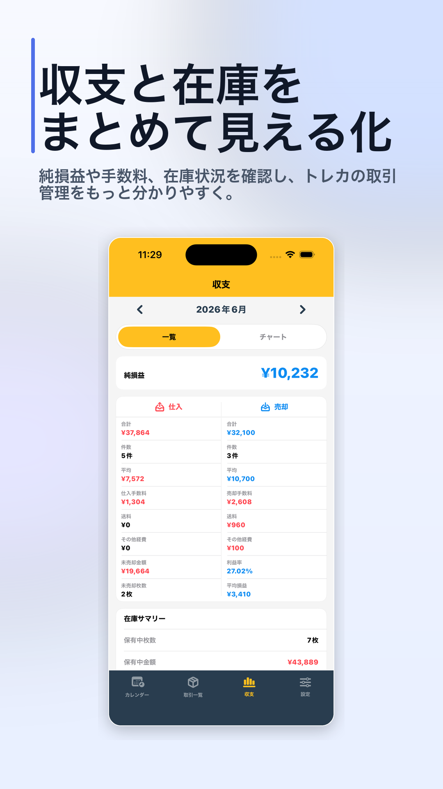
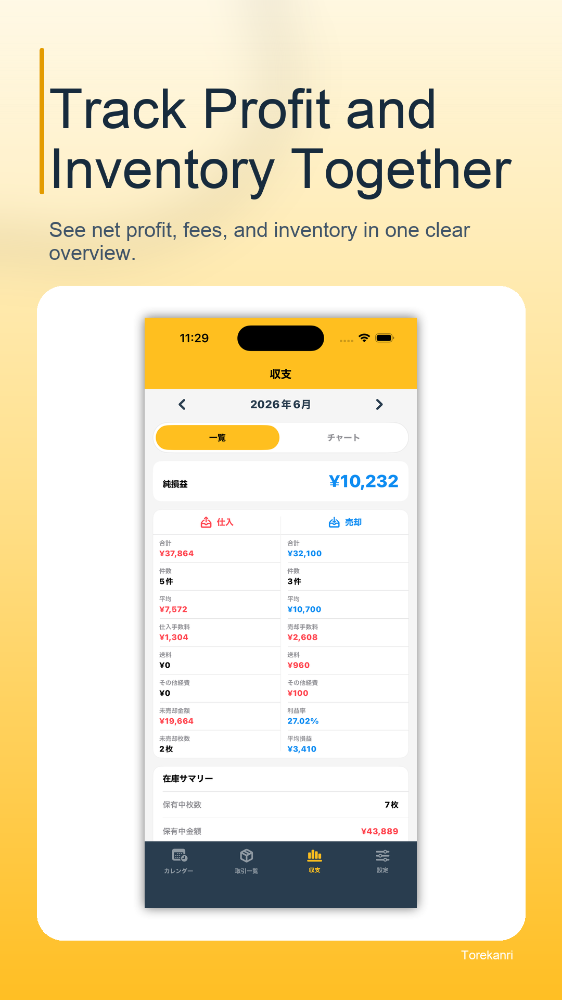

# トレカンリ生成例 / Torekanri Example

「トレカンリ」の実際のアプリ画面から、App Store／Google Play向けのストア掲載用画像を生成した例です。

This example generates App Store and Google Play listing images from screenshots of the real Torekanri app.

## 生成する / Generate

リポジトリのルートディレクトリで実行します。

Run this command from the repository root:

```bash
python generate.py --config examples/torekanri/config.yaml --overwrite
```

## 出力 / Outputs

- `generated/app-store/ja`: App Store向け・日本語
- `generated/app-store/en`: App Store向け・英語
- `generated/google-play/ja`: Google Play向け・日本語
- `generated/google-play/en`: Google Play向け・英語

## App Store向け・日本語 / App Store, Japanese

<p>
  
  
  
</p>

## Google Play向け・日本語 / Google Play, Japanese

<p>
  
  
  
</p>

## App Store向け・英語 / App Store, English

<p>
  
  
  
</p>

## Google Play向け・英語 / Google Play, English

<p>
  
  
  
</p>
